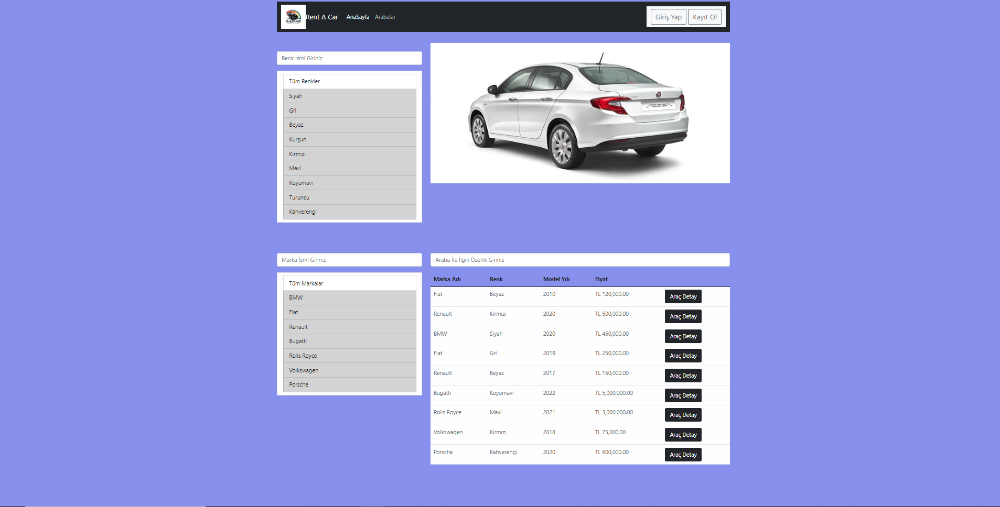
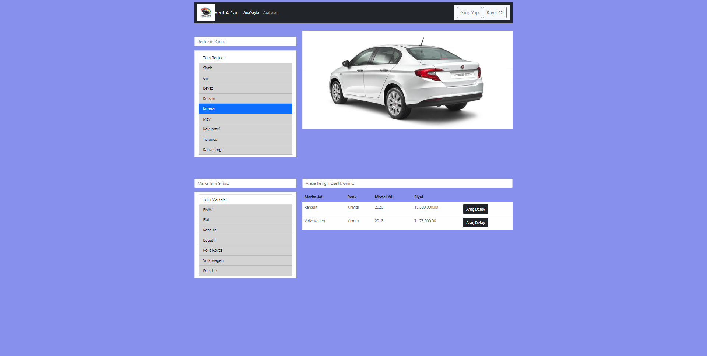
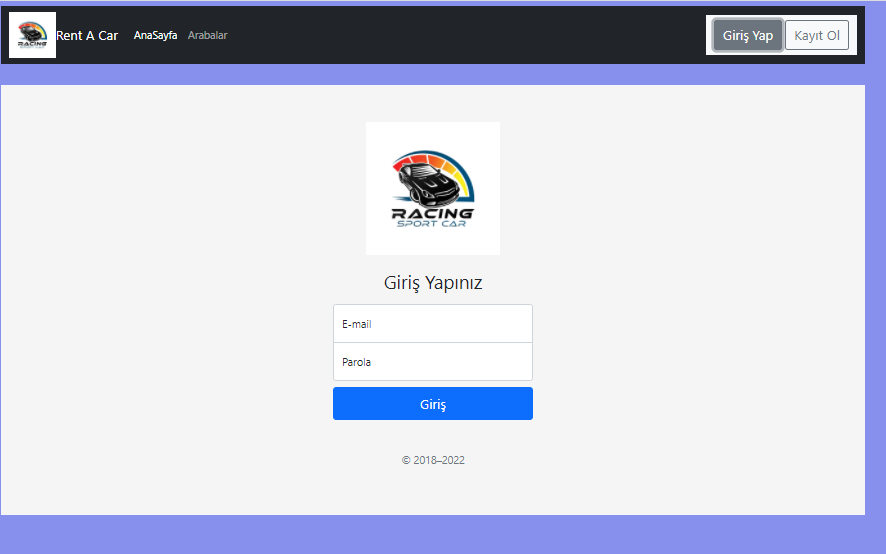
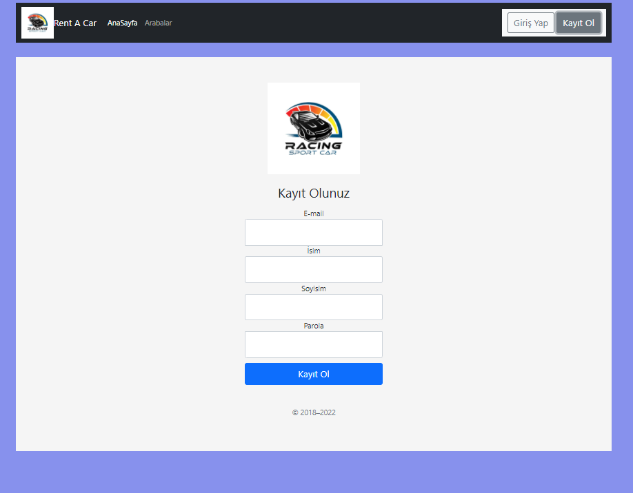
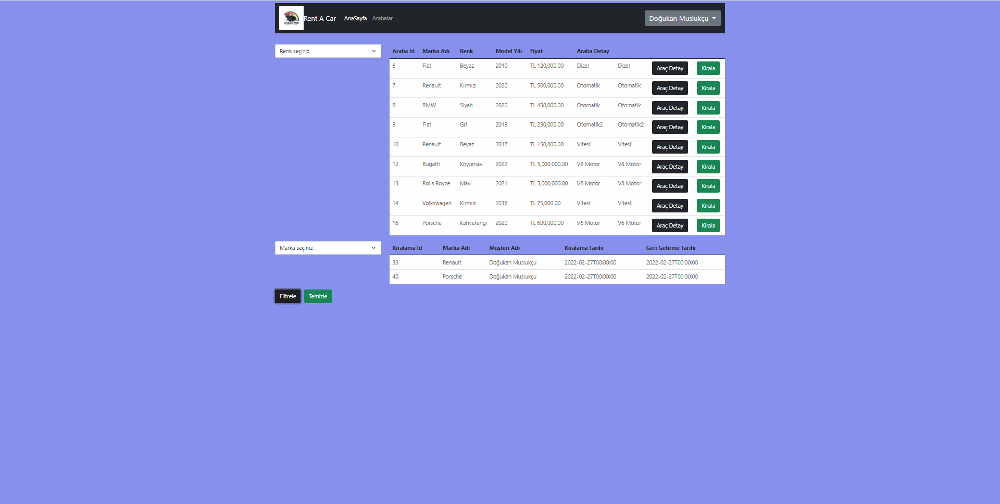
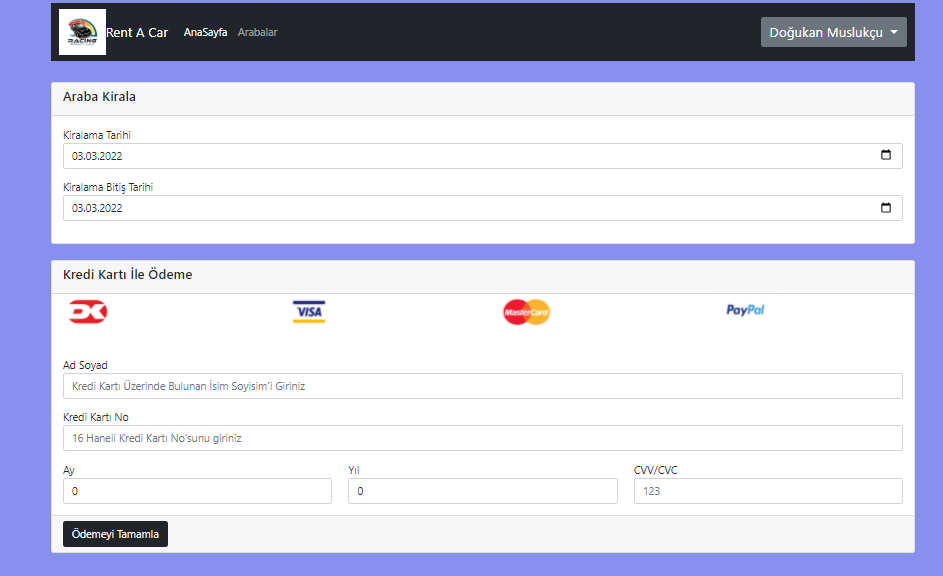
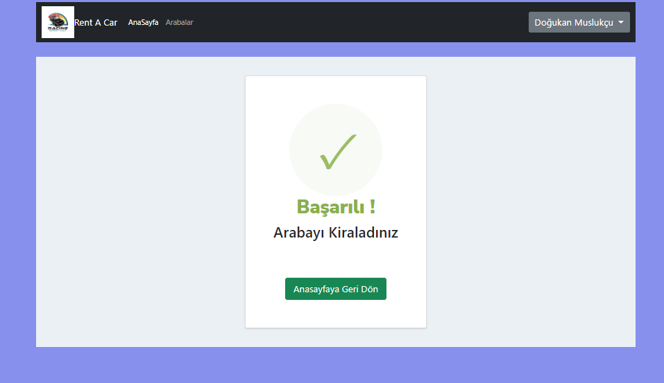
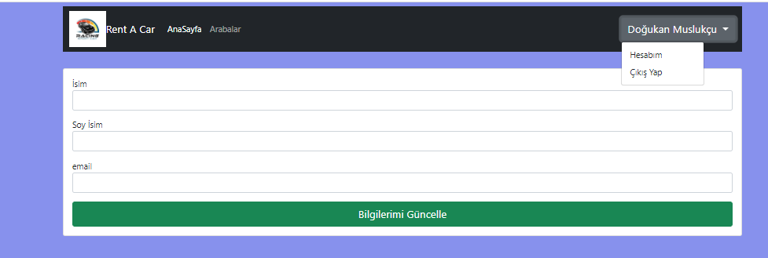

# RentACarFrontend

## Technologies
- Angular 13
- TypeScript
- Bootstrap
- Jquery

## Techniques
- JWT
- File Upload
- FormFile
- Interceptors
- Guards
- Pipes
- Service

## Images

### Home

### HomeWithFilter

### login

### Register

### Cars

### CarDetail

### Rental

### PaymentSuccess

### UserAccount

### UserUpdate

